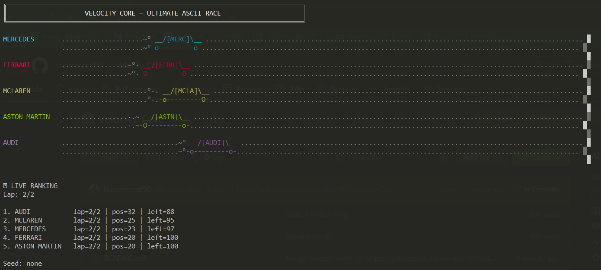

# Velocity Core — _Real-Time Racing Simulation Engine_

- Terminal Grand-Prix Edition 🏆🏁
- Deterministic multi-agent racing simulation rendered in pure ASCII.


---

<br/>

<p align="center">
  
</p>

<br/>

## 🧠 What is Velocity Core  / Why It Exists

**Velocity Core** is a high-performance **terminal-based simulation engine** modeling real-time racing dynamics between multiple agents.
All executed directly inside the terminal using **pure ASCII + ANSI rendering**.
Velocity Core explores how deterministic systems, stochastic physics, and real-time rendering can coexist in a constrained environment like a terminal.

This project is a minimal representation of:
- game engines
- simulation systems
- real-time distributed thinking

---

## 🧱 Core Capabilities

- 🏎️ Multi-agent racing simulation (5 concurrent vehicles)
- ⏱ Real-time game loop (tick-based engine)
- 🎲 Deterministic randomness (seed-based replay)
- 🎨 ASCII rendering engine with ANSI styling
- 💨 Dynamic smoke trail system
- 🔄 Animated wheel system
- 📊 Live ranking system
- 🧮 Distance & speed tracking
- 🏁 Deterministic winner resolution
- ✨ Blinking winner banner

---

## ⚙️ System Architecture
```bash
                          [ Player / CLI Input ]
                                   |
                                   v
        +---------------------------------------------------+
        |                    Velocity Core                  |
        |         terminal racing simulation engine         |
        +---------------------------------------------------+
                                   |
                                   v
        +---------------------------------------------------+
        |                  Configuration Layer              |
        |  - car brands                                     |
        |  - track length                                   |
        |  - speed mode                                     |
        |  - optional seed                                  |
        +---------------------------------------------------+
                                   |
                                   v
        +---------------------------------------------------+
        |                   Simulation Loop                 |
        |  - countdown                                      |
        |  - tick scheduler                                 |
        |  - frame update                                   |
        |  - race termination                               |
        +---------------------------------------------------+
                                   |
                                   v
        +---------------------------------------------------+
        |                    Physics Model                  |
        |  - random speed                                   |
        |  - turbo boost probability                        |
        |  - position update                                |
        |  - winner resolution                              |
        +---------------------------------------------------+
                                   |
                                   v
        +---------------------------------------------------+
        |                  Race State Engine                |
        |  - cars                                           |
        |  - positions                                      |
        |  - speeds                                         |
        |  - ranking                                        |
        +---------------------------------------------------+
                                   |
                                   v
        +-------------------------+     +-------------------------+
        |     ASCII Renderer      | --> |     Scoreboard UI       |
        |  - track drawing        |     |  - live ranking         |
        |  - cars rendering       |     |  - speed / distance     |
        |  - smoke / wheels       |     |  - final winner         |
        +-------------------------+     +-------------------------+
                                   |
                                   v
        +---------------------------------------------------+
        |                  Terminal Output                  |
        |  - live animated race                             |
        |  - blinking WINNER banner                         |
        |  - final standings                                |
        +---------------------------------------------------+

```
---

## 🏛️ Project Structure
```bash
velocity-core/
│
├── src/
│   ├── cli/
│   │   └── menu.js
│   │
│   ├── engine/
│   │   ├── race.js
│   │   ├── physics.js
│   │   ├── renderer.js
│   │
│   ├── utils/
│   │   └── random.js
│   │
│   └── index.js
│
├── package.json
└── README.md

```


## 🚀 Getting Started

1. 📦 Installation
```bash
git clone https://github.com/louismarcel90/velocity-core.git
cd velocity-core
npm install
```

2. Run
```sh
npm start
```

3. Optional (seed replay)
```sh
node src/index.js --seed=42
```
---

## 🎮 CLI Experience

At launch:

```sh

⚡ VELOCITY CORE

Nombre de tours : 1 - 5 (choose from 1 to 5 tours)
Vitesse : slow | normal | fast ( default: normal)
Seed : 42 
```
---

## 🎬 Terminal Preview

```bash
╔══════════════════════════════════════════════════════════════╗
║                 VELOCITY CORE — LIVE RACE                    ║
╚══════════════════════════════════════════════════════════════╝

MERCEDES      __________ _o==o\__ ______________________________  ║
FERRARI       _______________ _o==o\__ _________________________  ║
MCLAREN       __________________ _o==o\__ ______________________  ║
ASTON MARTIN  _________ _o==o\__ _______________________________  ║
AUDI          ______________________ _o==o\__ __________________  ║

──────────────────────────────────────────────────────────────
🏁 WINNER: MERCEDES 
```
---


## 📊 Example Output
```sh
🏁 RACE FINISHED

██████████████████████████
███ WINNER: FERRARI    ███
██████████████████████████

1. FERRARI       60 pts
2. MERCEDES      58 pts
3. MCLAREN       55 pts
4. ASTON MARTIN  52 pts
5. AUDI          49 pts
```

---

## ⚙️ Engineering Notes

- Deterministic RNG ensures reproducible simulations
- Tick-based loop avoids time drift issues
- Rendering is decoupled from physics updates
- Stateless frame computation for predictability

---

## 🔮 Future Work

- Multi-race championship mode
- Distributed simulation (multi-node)
- AI-driven car strategies
- Replay system
- Web visualization layer

---

## 👨‍💻 Author

Built with precision, systems thinking, and performance-first mindset.

---
  
## 📄 License

MIT License
